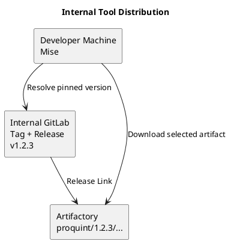

# Testing Artifactory as a source for github-released app usage via mise

On any System (Windows using GitBash)

The Compose file includes a fixed development-only Artifactory master key. Set
`JF_SHARED_SECURITY_MASTERKEY` before starting the stack to supply your own
stable 32-character key.

On a POSIX shell, generate and export one with:

```shell
export JF_SHARED_SECURITY_MASTERKEY="$(openssl rand -hex 16)"
```

Keep the generated value somewhere secure and reuse it whenever you start the
same Artifactory data volume.

Run `mise run proquint-fetch` before using the mirrored tool. If credentials
are missing or rejected, it prints the Artifactory "Set Me Up" token workflow
and a copyable heredoc command to create the dedicated
`~/.mise-artifactory.netrc` file. Bash is required and is provided by Git Bash
on Windows.

The project `mise.toml` redirects downloads for `github:iilei/proquint@0.2.8`
to the seeded Artifactory path. Version discovery still uses GitHub's release
metadata.

Artifactory is pinned to `7.104.12` because the current `latest` OSS image can
leave its web frontend retrying failed entitlement requests. Do not downgrade
an existing Artifactory database; use the cleanup commands below before
starting this test stack after the version change.

```shell
docker compose up -d
# Wait until the service is healthy, then seed it from Git Bash:
docker compose ps
bash ./seed.sh
```

Visit [JFrog Web UI](http://localhost:8082/ui/)

```
Username: admin
Password: password
```

Or Test using Curl

```
curl -u admin:password -O \
  http://localhost:8081/artifactory/example-repo-local/proquint/0.2.8/proquint_0.2.8_windows_amd64.zip
```

```shell
# Stop and remove containers + network
docker compose down

docker volume rm mise_test_artifactory_data
docker volume rm mise_test_postgresql_data
```

```shell
mise run proquint-decode gabun
```

## Round-Trip

```shell
mise run proquint-encode $(mise run proquint-decode gabun)
```

## Verify Install location

```powershell
mise exec "github:iilei/proquint@0.2.8" -- where proquint
```

## Internal GitLab Releases and Artifactory

For company-owned tools, use GitLab Releases for version discovery and Artifactory for binary distribution. This works with Mise's native `gitlab:` backend; no custom Mise plugin is required.

See [docs/internal-tool-distribution.puml](docs/internal-tool-distribution.puml) (render with `plantuml -tpng docs/internal-tool-distribution.puml`):



GitLab must contain a Release for each published tag. Tags alone are insufficient: Mise lists GitLab Releases with attached links, not arbitrary Git tags. Each release link is an external URL to an Artifactory artifact. Its `name` is the value Mise matches with `asset_pattern`.

### Publish a tagged release

Publish the platform archives, checksums, and signatures to Artifactory first. Then create a GitLab Release for the same tag and attach one release link for each platform archive. A tag-triggered pipeline can do both:

```yaml
release:
  stage: release
  image: registry.gitlab.com/gitlab-org/cli:latest
  rules:
    - if: $CI_COMMIT_TAG
  script:
    - echo "Artifacts were uploaded to Artifactory by the preceding publish job"
  release:
    tag_name: $CI_COMMIT_TAG
    name: "proquint $CI_COMMIT_TAG"
    description: "Published to Artifactory."
    assets:
      links:
        - name: "proquint_${CI_COMMIT_TAG}_linux_x86_64.tar.gz"
          url: "https://artifactory.intranet.example/artifactory/tools/proquint/${CI_COMMIT_TAG}/proquint_${CI_COMMIT_TAG}_linux_x86_64.tar.gz"
          link_type: package
        - name: "proquint_${CI_COMMIT_TAG}_darwin_arm64.tar.gz"
          url: "https://artifactory.intranet.example/artifactory/tools/proquint/${CI_COMMIT_TAG}/proquint_${CI_COMMIT_TAG}_darwin_arm64.tar.gz"
          link_type: package
```

This example uses the raw tag, such as `v0.2.8`, in both the Artifactory path and asset name. GitLab's `release:assets:links` accepts CI variables but does not perform shell parameter expansion inside YAML values. If Artifactory omits the `v` prefix, create the release from a script using `glab release create` or the GitLab API, where the shell can derive a normalized version first.

The equivalent manual GitLab UI workflow is: create a Release for the existing `v1.2.3` tag, then add an asset link whose name identifies the archive and whose URL is the Artifactory download URL.

### Consume from Mise

Point Mise at the self-hosted GitLab API and pin a release version. Use platform-specific patterns when each platform has a distinct archive:

```toml
[tools."gitlab:platform/proquint"]
version = "0.2.8"
api_url = "https://gitlab.intranet.example/api/v4"

[tools."gitlab:platform/proquint".platforms]
linux-x64 = { asset_pattern = "proquint_0.2.8_linux_x86_64.tar.gz" }
macos-arm64 = { asset_pattern = "proquint_0.2.8_darwin_arm64.tar.gz" }
```

Mise queries GitLab for the `v0.2.8` release, matches the corresponding release link, and downloads that link directly from Artifactory. No `url_replacements` rule is needed because the Release Link already contains the internal Artifactory URL.

For private GitLab, configure a GitLab token through `MISE_GITLAB_ENTERPRISE_TOKEN`, `glab`, Git credentials, or Mise's global token configuration. Configure Artifactory credentials separately for its hostname, for example in a `~/.netrc` file. Do not put either credential in the project `mise.toml`.

### Renovate Pinning

Consumers should commit a concrete version rather than use `latest`. Renovate can update the `version` field in `mise.toml` after a new GitLab Release is published:

```toml
[tools."gitlab:platform/proquint"]
version = "0.2.8" # renovate: datasource=gitlab-releases depName=platform/proquint registryUrl=https://gitlab.intranet.example
api_url = "https://gitlab.intranet.example/api/v4"
```

This makes the installed artifact reproducible at review time while leaving Renovate responsible for proposing version bumps. Give Renovate a GitLab token with read access to the internal project and configure its GitLab endpoint to reach the intranet host. Protect release tags and publish Artifactory artifacts immutably so that a pinned version always identifies the same bytes.
